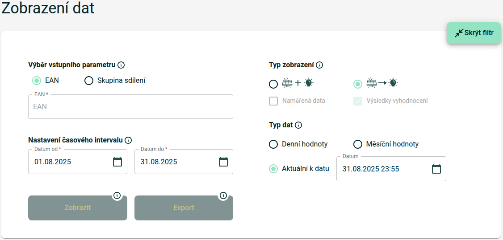

# Energy data provider: EDC - Energetické Datové Centrum (edc-cr.cz)

This script processes data exports from EDC - Energetické Datové Centrum. The data represents solar energy shared between community producers and consumers.

**Data provided**
- Solar production - High resolution (hourly, aggregated from 15-minute intervals) - kWh

**Tooling needed**
- Python 3
- Pandas python library `pip install pandas`
- Tzlocal python library `pip install tzlocal`

**Input file format**
The expected CSV file format:
- Separator: Semicolon (`;`)
- Decimal: Comma (`,`) - European format
- Date format: `dd.mm.yyyy` (e.g., `01.08.2025`)
- Columns: `Datum;Cas od;Cas do;{Producer EAN}-{Consumer EAN}`

Example:
```csv
Datum;Cas od;Cas do;123456789987654321-987654321123456789
01.08.2025;00:00;00:15;0,0;
01.08.2025;00:15;00:30;0,0;
01.08.2025;11:00;11:15;0,25;
```

The 4th column contains the energy value in kWh for each 15-minute interval. The column header is typically formatted as `{Producer EAN}-{Consumer EAN}` where EAN is the unique metering / supply point identifier.

**How-to**

**Step 1: Export data from EDC portal**
1. Go to [EDC portal](https://portal.edc-cr.cz) (Energetické Datové Centrum) and login with your username/password
2. Navigate to "Správa dat" and then to "Zobrazení a export dat"
3. Configure the export (see screenshot below):
   - **EAN odběrného místa** (Consumer EAN): Enter your consumer EAN number
   - **Časový interval** (Time interval): Select start and end dates
     - Note: If you only need to export data (not display), you can select an interval longer than 31 days
   - **Typ zobrazení** (Display type): Select the radio button above **Výsledky vyhodnocení** 
     (Zobrazení dat pro páry výrobních a odběrových EAN)
4. Click Export and download CSV from Reporty



**Step 2: Prepare and import data**
1. Download the `EDCCRDataPrepare.py` and the `DataPrepareEngine.py` (Datasources directory) files
2. Place them in the same directory as your CSV data file
3. Execute the python script:
   ```bash
   python EDCCRDataPrepare.py "export.csv"
   ```
4. The script creates `elec_solar_high_resolution.csv` for the generic import script
5. Follow the steps in the overall how-to to import into Home Assistant

**Configuration notes**
- The script automatically aggregates 15-minute data to hourly intervals for better Home Assistant performance
- Data is treated as local time (Europe/Prague timezone) with automatic DST handling
- Values are interpreted as usage per interval (not cumulative meter readings)

**Optional Step: Provide starting reading**

By default, source data is treated as per-interval usage starting at zero.
When the meter's initial reading is not zero or readings began after installation, an explicit initial value can be applied.
This step is optional but can prevent a spike at the point where imported data crosses over into existing Home Assistant statistics.

1. **Run with zero baseline**
   Execute the script to generate the CSV file(s). The first reading will be treated as zero by default.

2. **Choose a common timestamp**
   Identify an epoch (first-column timestamp) present in both the exported CSV and Home Assistant's `statistics` table.

3. **Compare readings**
   - In the CSV, record the cumulative value at that timestamp.
   - In the `statistics` table, locate the row where `start_ts` equals that epoch and note its `state`.

4. **Calculate the baseline**
   ```text
   initialValue = (Home Assistant state) – (exported cumulative at that epoch)
   ```

5. **Add the `initialValue` parameter and re-run**
   Edit `EDCCRDataPrepare.py` and add `initialValue=<calculated value>` to the OutputFileDefinition.
   Execute the script again to regenerate the CSV file.
