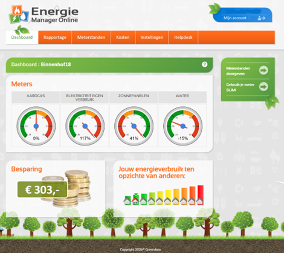

# Energy data provider: Energie Manager Online (www.energiemanageronline.nl)

Energiemanageronline offers the option to export data from the [Energiemanageronline](https://www.energiemanageronline.nl/) website. This data can be transformed and used to import into Home Assistant.



**Data provided**
- Electricity consumption - Tariff 1 - High resolution (hour interval) - kWh
- Electricity consumption - Tariff 2 - High resolution (hour interval) - kWh
- Electricity production - Tariff 1 - High resolution (hour interval) - kWh
- Electricity production - Tariff 2 - High resolution (hour interval) - kWh

**Important notes**
- Two preparation scripts are available:
  - `EnergieManagerDataPrepare_site.py` is the **standard** script and should be used with CSV exports from the website.
  - `EnergieManagerDataPrepare_api.py` is an **exception-only** script and can only be used when Energiemanageronline shares an API token. This is not standard and is only available in exceptional cases.
- The current script supports **electricity consumption** and **electricity production**. Other data can be added easily by adding an extra output definition and by selecting the matching source column in the export.

**Tooling needed**
- Python 3
- Pandas python library `pip install pandas`
- Tzlocal python library `pip install tzlocal`

**How-to**
- Export data from the Energiemanageronline website
- In the Energiemanageronline website go to: `Rapportage -> Verbruik`
- Select `Tabel`
- Select `Elektriciteit inkoop`
- Set the **resolution to hour**
- Set the required period
- Download the CSV export
- If needed, repeat this for other exports or date ranges
- Download the `EnergieManagerDataPrepare_site.py` and the `DataPrepareEngine.py` (Datasources directory) files and put them in the same directory as the downloaded CSV file(s)
- Execute the python script with as parameter the CSV export file(s): `python EnergieManagerDataPrepare_site.py *.csv`
- The python script creates the needed file(s) for the generic import script
- Follow the steps in the overall how-to

**Alternative API-based method**
- Only use this method when Energiemanageronline has explicitly provided an API token
- Use `curl` to download one or more CSV export files from the Energiemanageronline API<br>
  Example:
  ```bash
  curl -o export_2025.csv "http://dev.energiemanageronline.nl/services/export/meetdata.php?access_token=<TOKEN>&fromdate=2025-01-01&tilldate=2025-12-31&maxrows=100000&output=csv"
  ```
- Repeat the `curl` step for additional year ranges if needed
- Download the `EnergieManagerDataPrepare_api.py` and the `DataPrepareEngine.py` (Datasources directory) files and put them in the same directory where the API export CSV files will be stored
- Execute the python script with as parameter the API CSV export file(s): `python EnergieManagerDataPrepare_api.py *.csv`
- The python script creates the needed file(s) for the generic import script
- Follow the steps in the overall how-to

**Notes about tariffs**

The site script uses the tariff columns from the website export directly.
The API script derives tariff 1 and tariff 2 from the timestamp using the script logic.
Verify the tariff mapping against your own sensors and supplier setup before importing the data into Home Assistant.


